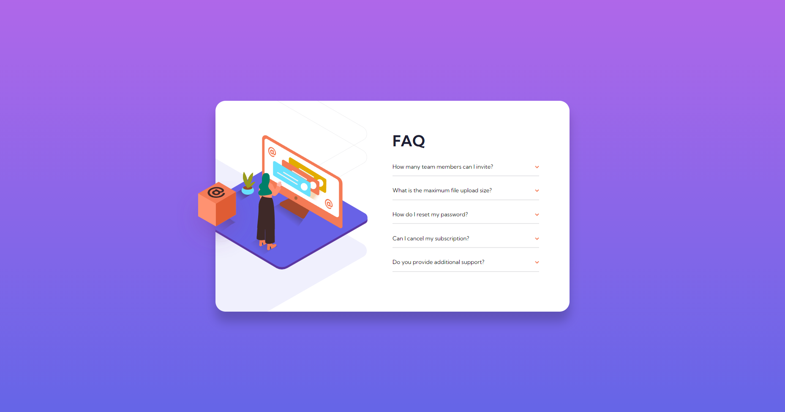

# Frontend Mentor - FAQ accordion card solution

This is a solution to the [FAQ accordion card challenge on Frontend Mentor](https://www.frontendmentor.io/challenges/faq-accordion-card-XlyjD0Oam). Frontend Mentor challenges help you improve your coding skills by building realistic projects. 

## Table of contents

- [Overview](#overview)
  - [The challenge](#the-challenge)
  - [Screenshot](#screenshot)
  - [Links](#links)
- [My process](#my-process)
  - [Built with](#built-with)
  - [What I learned](#what-i-learned)

## Overview

### The challenge

Users should be able to:

- View the optimal layout for the component depending on their device's screen size
- See hover states for all interactive elements on the page
- Hide/Show the answer to a question when the question is clicked

### Screenshot

### Links

- [Solution URL](https://github.com/jma26/FAQ-accordion-FE-Mentor-5)
- [Live Site URL](https://jma26.github.io/FAQ-accordion-FE-Mentor-5/)

## My process

### Built with

- HTML5
- CSS
- Flexbox
- Mobile-first workflow

### What I learned

This challenge was a bit more difficult compared to the earlier challenges. I had trouble figuring out how to implement the desktop images with the bg-pattern and did not realize I could do this with the help of `background-image, background-position etc.` (seems like I'm not thinking about the css background property and defaulting to using `img` element). In addition, I had an issue dealing with the parent height jumping as the child element (accordion) expands and collapses. For now, I used a fixed height on the parent but am curious how this issue can be achieved or fixed.

Tried to make sure the accordion complies with ADA Web Accessibility and is toggleable with a keyboard etc.

### Continued development

I would like to focus on finding best or optimized practice in figuring out the height jump issue. In addition, I would like to add a bit of smoother transition effect when the accordion sections expands, collapses. 